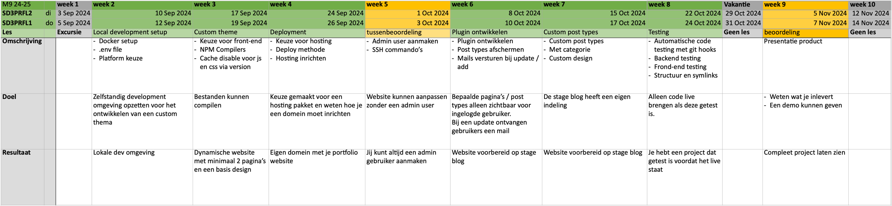

# StageBlog - {{ page.title }}

Op deze website vind je de opdrachten voor de unit M9PROG waarbij wij een stage blog gaan ontwikkelen.  
Tijdens de lessen doorlopen wij een aantal items, Wordpress is een leidraad indien je zelf een ander framework gebruikt heb je minder werk.  
Een aantal onderdelen die wij behandelen zijn: compilers, deployment, ssh, testing

---

## Planning

---

## Opdrachten en uitleg


{% assign today = "now"|date:"%Y%m%d" %}
{% assign lesson_date = lesson.datum|date:"%Y%m%d" %}


## Les {{ lesson.number }}:  {{ lesson.title }}
{: .text-blue-100 :}

{{ lesson.description }}

[Start](les-{{ lesson.number }} ){: .btn .btn-blue }

## Les {{ lesson.number }}:  {{ lesson.title }}
{: .text-grey-dk-000 :}

Deze les komt binnenkort online. 
<small>Vanaf {{ lesson.datum|date:"%d-%m-%Y" }} online </small>

---


