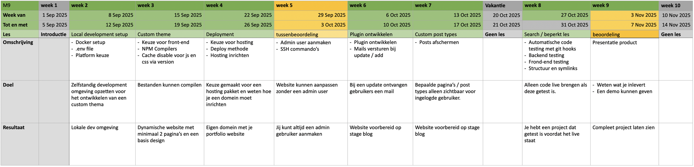

# M9PROG - WordPress Portfolio

In deze unit ontwikkel je een portfolio waarmee je jezelf aan stagebedrijven en opdrachtgevers presenteert. Je bouwt een custom WordPress-theme vanaf scratch, werkt met Bootstrap, Sass, npm en Webpack en zet je site uiteindelijk live op een eigen webomgeving.

AI helpt je in de eerste les om snel een eerste resultaat te maken. Daarna leer je die code stap voor stap begrijpen, testen en zelf aanpassen. Je levert dus geen AI-resultaat in dat je niet kunt uitleggen.

---

## Planning

---

## Voor docent en student

- [Complete lesbrief](lesbrief): leerdoelen, didactiek, lesverloop en beoordeling per lesmoment.
- [M9 Leercoach](m9-leercoach): een interactieve prompt voor uitleg, planning, feedback en debugging.
- [Projectomschrijving](project_description): de eisen voor het live portfolio.

---

## Lessen, opdrachten en uitleg


{% assign today = "now"|date:"%Y%m%d" %}
{% assign lesson_date = lesson.datum|date:"%Y%m%d" %}


## Les {{ lesson.number }}:  {{ lesson.title }}
{: .text-blue-100 :}

{{ lesson.description }}

[Start](les-{{ lesson.number }} ){: .btn .btn-blue }

## Les {{ lesson.number }}:  {{ lesson.title }}
{: .text-grey-dk-000 :}

Deze les komt binnenkort online. 
<small>Vanaf {{ lesson.datum|date:"%d-%m-%Y" }} online </small>

---


