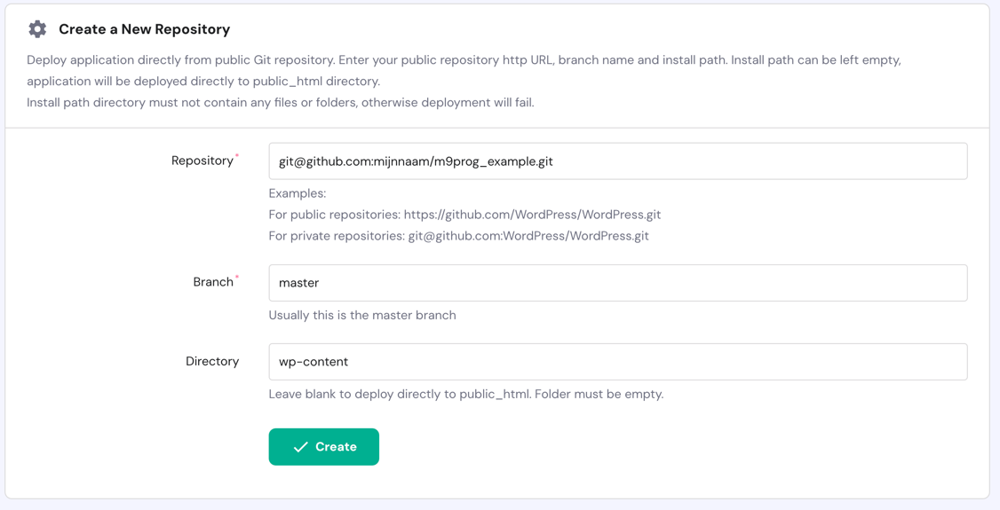

## Hosting
{: .text-green-100 .fs-6 }
Webhosting is een dienst waarmee individuen en bedrijven hun websites beschikbaar kunnen maken op het internet.  
Een provider biedt serverruimte waar de bestanden van een website worden opgeslagen en beheerd. Wanneer iemand een website bezoekt, worden deze bestanden vanaf de server naar de browser van de gebruiker verzonden.  
Er zijn verschillende soorten hosting, zoals:
- shared hosting _(waar meerdere websites op één server staan)_
- VPS-hosting _(Virtual Private Server)_
- dedicated hosting _(waar een website zijn eigen server heeft)_
- cloud hosting _( waarbij een dynamisch aantal servers gekoppeld zijn aan één service )_  
De keuze voor een type hosting hangt af van de grootte van de website en de technische vereisten.

---
### Vereisten voor onze website:
- PHP _( version 8.0 or higher )_
- MySQL _(version 5.7 or higher)_ or MariaDB _(version 10.4 or higher)_
- HTTPS support
- Apache / Nginx
- SSH toegang
- Deployment via git

---
### 1- Hosting
Sluit een hosting af en doorloop de stappen vor het instellen van een domein.

---
### 2- Wordpress installatie
Stel nu een standaard WordPress installatie in op deze server zodat de structuur en database ingericht zijn.  
Na het doorlopen vna de installatie kun je inloggen via ftp of via de file browser om alle inhoud uit de `wp-content` te verwijderen.  
Die moet om ervoor te zorgen dat je straks de repository kunt koppelen en de bestanden goed kunt deployen

---
### 3- Negeer uploads folder
Uploads op de server mogen niet overschreven worden door jouw lokale uploads, daarom moet de uploads folder straks niet overschreven worden.  
Stel in je lokale `.gitignore` in dat de `uploads` folder niet bijgehouden mag worden door git.  
Verwijder deze `upload` folder in github via de web interface.

---
### 4- SSH-sleutel
Voeg de sleutel van de server toe aan git.  
1- Genereer een ssh sleutel  

2- ga nu naar [gighub.com](https://github.com/) en zoek jouw repository op in het overzicht.  
3- ga naar de tab 'settings' en maak een nieuwe deploy key aan waar je de ssh key van de hosting in plakt.  

Plak in deze in het ssh key veld.  
Op dit moment heeft de hosting server toegang tot jouw git omgeving.

---
### 5- Link de repository 
Ga nu weer naar de hosting partij en vul de gegevens voor het koppelen van een Repository in door het formulier van `Create a New Repository` in te vullen.    
- gebruik bij de url de beveiligde verbinding
- de master branch/tak heet bij jou waarschijnlijk **main**
- de folder is wp-content
  

---
### 6- testen
Log nu in op jouw website en voeg een nieuwe pagina toe **inclusief** een afbeelding.

---
### 7- CD
Wil je het voor jouw zelf nog makkelijker maken?  
Stel dan de auto deployment in, volg hiervoor de stappen die je ziet als je klikt op 'auto deployment'

---
### 8- testen
Test nogmaals door lokaal een aanpassing te doen in jouw thema, commit en push deze wijziging en zie dat dit direct is doorgevoerd op de live website.