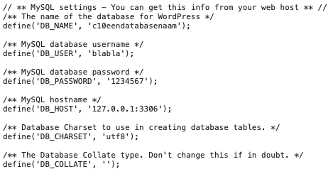

## WordPress admin gebruiker 
{: .text-green-100 .fs-6 }

De admin-gebruiker van WordPress heeft volledige controle over de website, met toegang tot alle instellingen, functies en inhoud. 
Deze rol stelt de beheerder in staat om gebruikers te beheren, plugins en thema's te installeren, en alle pagina's en berichten te bewerken of te verwijderen.  
  
Het kan gebeuren dat je geen toegang meer hebt tot een WordPress website, in de volgende stappen gaan wij via een andere weg weer toegang krijgen tot de website.  

---
### 1- Wachtwoord vergeten, via de database
Als je een gebruiker hebt in de database waarvan je het wachtwoord bent vergeten kun je inloggen in de database om het wachtwoord aan te passen.  
Hiervoor heb je de login gegevens nodig van de database, deze kun je vinden in de `wp-config.php`  
  
Door deze gegevens te gebruiken kun je inloggen via **phpmyadmin** of een andere tool.  Misschien moet je eerst nog even de tool installeren.  
Een andere veel gebruikte tool is [admininer](https://www.adminer.org). [download](https://github.com/vrana/adminer/releases/download/v4.8.1/adminer-4.8.1.php)  
Zodra je toegang hebt tot de database kun je het wachtwoord aanpassen, zorg ervoor dat je een md5 hash gebruikt. WordPress zet daarna je wachtwoord om naar een echt gecodeerd wachtwoord.
Hiervoor kun je bijvoorbeeld deze query gebruiken:
```mysql
UPDATE wp_users SET user_pass=md5('moeilijkwachtwoord') WHERE ID=99;
```

Zodra je het wachtwoord hebt aangepast kun je met de gebruikersnaam die je bij dat record zag inloggen.


---
### 2- Admin user aanmaken via een php script.
Je kunt ook eenvoudig een gebruiker aanmaken en die admin rechten geven. Hiervoor moet je wel toegang hebben tot de bestanden.  
Plaats dit script in een php bestand waar WordPress geladen is. _( zorg wel dat de variabele gedefinieerd zijn )_
```php
// Check that user doesn't already exist
if ( ! username_exists( $username ) && ! email_exists( $email ) ) {
	// Create user and set role to administrator
	$user_id = wp_create_user( $username, $pass, $email );
	if ( is_int($user_id) )	{
		$wp_user_object = new WP_User($user_id);
		$wp_user_object->set_role('administrator');
	}
}
```
Voor een multisite kun je dit commando gebruiken:
```php
// Create multisite admin user:
grant_super_admin($user_id);
```

---
### 3- Admin user aanmaken via een CLI script.
Via CLI kun je ook een gebruiker aanmaken en die vervolgens de juiste rechten geven.  
Daarvoor gebruik je het volgende commando in de terminal, voer dit uit in dezelfde directory als WordPress staat.
```ssh
wp user create mijnnaam jasper@email.nl --role=administrator
```
Vervolgens stel ik de admin rechten in voor de user, stel dat na het aanmaken het ID 12345 is dan gebruik ik het volgende commando:  
```ssh
wp user set-role 12345 administrator
```

---
### Volgende stap:
{: .text-green-100 .fs-4 }  
[SSH commando s](ssh)
