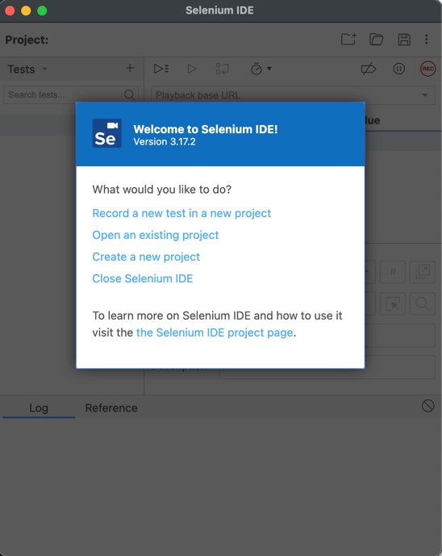
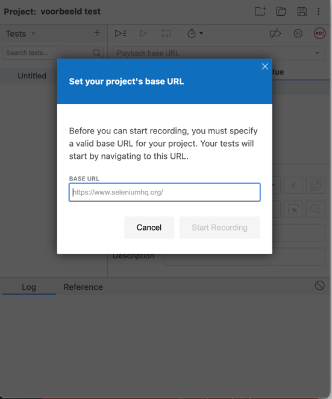
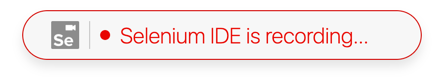

## Frontend testing
{: .text-green-100 .fs-6 }

Een frontend test controleert de functionaliteit en het gedrag van de gebruikersinterface (UI) van een applicatie, waarbij wordt nagegaan of de interface correct reageert op interacties van de gebruiker.  
Dit omvat het testen van **knoppen**, **formulieren** en **navigaties**, om ervoor te zorgen dat alles werkt zoals bedoeld.  

### Behat
Meer informatie: [behat.org](https://docs.behat.org/en/latest/)  
Met `Behat`, _een tool voor behavior-driven development (BDD)_, kun je frontend tests schrijven in begrijpelijke, scenario-gebaseerde taal.  
Bijvoorbeeld:
```shell
Scenario: Gebruiker logt succesvol in
    Given ik ben op de loginpagina
    When ik vul "gebruikersnaam" in met "testgebruiker"
    And ik vul "wachtwoord" in met "geheim123"
    And ik klik op de "inloggen" knop
    Then zie ik "Welkom, testgebruiker" op de homepage
```
Deze test simuleert de stappen van een gebruiker en controleert of de UI correct reageert.

---
### Selenium
Meer informatie: [selenium.dev](https://www.selenium.dev/)  
Selenium is de meest populaire automatiseringstool, het bestaat al decennia, en zelfs vandaag de dag is Selenium een sterke concurrent voor veel moderne automatiseringstools.  
Selenium is een open-source front-end automatiserings testbibliotheek.  
Het ondersteunt de browsers Firefox, Chrome, Edge en Safari op Windows-, macOS- en Linux-platforms.  
Selenium neemt de programmeertaal barrière weg door ondersteuning te bieden voor populaire programmeertalen zoals Python, Java, Javascript, C# en Ruby.

---
### Opdracht: Selenuim implementeren
Deze opdracht begeleidt je bij het opzetten van Selenium en het automatiseren van een eenvoudige taak in Chrome, zoals het bezoeken van een website en het opvragen van een titel:

---
#### **1. Installeer Python**
Python geïnstalleerd op je computer: [python.org](https://www.python.org/downloads/)

#### **2. Installeer Selenium**
Open de terminal of command line en installeer de Selenium-bibliotheek met pip:
```bash
pip install selenium
```

#### **3. Download de Chrome WebDrive**r
Ga naar [ChromeDriver](https://sites.google.com/chromium.org/driver/) en download de versie van de ChromeDriver die overeenkomt met jouw versie van Google Chrome.  
Pak het bestand **uit** en **plaats** de `chromedriver` in een map die je gemakkelijk kunt vinden.

#### **4. Schrijf je eerste Selenium-script**
Schrijf een script dat Selenium gebruikt om:
1. de Chrome-browser te openen,  
2. naar een website te gaan (bijvoorbeeld "https://www.wikipedia.org")
3. haal de titel van de pagina op

```python

from selenium import webdriver
from selenium.webdriver.chrome.service import Service
from selenium.webdriver.common.by import By

# Locatie van de gedownloade chromedriver
chrome_driver_path = "/pad/naar/chromedriver"

# Maak een nieuwe Chrome sessie
service = Service(chrome_driver_path)
driver = webdriver.Chrome(service=service)

# Ga naar de website
driver.get("https://www.wikipedia.org")

# Haal de titel van de pagina op
page_title = driver.title

# Print de titel in de console
print(f"De titel van de pagina is: {page_title}")

# Sluit de browser
driver.quit()

```

#### **5. Uitvoeren van het script**
Voer het script uit in je IDE of via de `terminal`.  
De **browser** zou kort moeten openen, naar Wikipedia moeten gaan, en de **titel** van de pagina in je console printen.  
Vervolgens wordt de **browser** gesloten.


---
### 2- Via een browser plugin 
Je kunt ook een test script maken door een plugin in je browser te gebruiken.  

#### **1. Voeg de browserextensie toe aan jouw browser**
Voeg de `selenium-ide` extensie toe aan je browser, bijvoorbeeld via de chrome store:  
[selenium-ide](https://chromewebstore.google.com/detail/selenium-ide/mooikfkahbdckldjjndioackbalphokd?hl=en)

#### **2. Start script**
Open de extensie en maak een nieuw script:  


#### **3. Definieer een website** 
Geef op welke website je wilt testen:  


#### **4. Verwerk de test**
Klik nu rond op jouw website om aan te geven wat je wilt testen.  
  
Na het klikken stop je de test en zie je in het `Selenium` popup scherm een resultaat.


---
### 3- Opslaan van scripts
Plaats jouw test script(s) in een test folder in de root van je repository.


---


---
### Volgende stap:
{: .text-green-100 .fs-4 }  
In de volgende opdracht ga je een de backend tests ontwikkelen.  
[Backend Code testing](backend)


